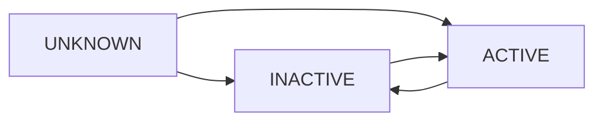

`SubscriptionStatus` represents the subscription status of the user. It indicates whether the user is unknown, inactive, or active with specific entitlements.

## Definition

```typescript
type SubscriptionStatus =
  | {
      status: "UNKNOWN"
    }
  | {
      status: "INACTIVE"
    }
  | {
      status: "ACTIVE"
      entitlements: Entitlement[]
    }
```

## Status Types

### UNKNOWN

The subscription status has not yet been determined or is unavailable.

<ResponseField name="status" type="'UNKNOWN'" required>
  Indicates the subscription status is not yet known.
  
  This can be an initial state before the SDK fetches the status from the server.
</ResponseField>

### INACTIVE

The user does not have an active subscription.

<ResponseField name="status" type="'INACTIVE'" required>
  Indicates the user has no active subscription.
  
  The user is not currently entitled to any subscription-based features.
</ResponseField>

### ACTIVE

The user has an active subscription with associated entitlements.

<ResponseField name="status" type="'ACTIVE'" required>
  Indicates the user has an active subscription.
</ResponseField>

<ResponseField name="entitlements" type="Entitlement[]" required>
  A list of entitlements the user has access to due to their active subscription.
  
  This array is only present when the status is "ACTIVE".
  
  <Expandable title="Entitlement properties">
    <ResponseField name="id" type="string">
      The unique identifier for the entitlement.
    </ResponseField>
    <ResponseField name="type" type="EntitlementType">
      The type of the entitlement. Currently only `"SERVICE_LEVEL"` is used.
    </ResponseField>
  </Expandable>
</ResponseField>

## Usage

### Basic Access Control

```typescript
import { useUser } from 'expo-superwall'

function PremiumFeature() {
  const { subscriptionStatus } = useUser()
  
  if (subscriptionStatus.status === 'ACTIVE') {
    return <PremiumContent />
  }
  
  return (
    <View>
      <Text>This feature requires a premium subscription</Text>
      <Button title="Subscribe" onPress={showPaywall} />
    </View>
  )
}
```

### Checking Specific Entitlements

```typescript
import { useUser } from 'expo-superwall'

function hasEntitlement(
  subscriptionStatus: SubscriptionStatus,
  entitlementId: string
): boolean {
  if (subscriptionStatus.status !== 'ACTIVE') {
    return false
  }
  
  return subscriptionStatus.entitlements.some(
    entitlement => entitlement.id === entitlementId
  )
}

function ExclusiveFeature() {
  const { subscriptionStatus } = useUser()
  const hasAccess = hasEntitlement(subscriptionStatus, 'premium_tier')
  
  if (!hasAccess) {
    return <UpgradePrompt />
  }
  
  return <ExclusiveContent />
}
```

### Loading States

```typescript
import { useUser } from 'expo-superwall'

function SubscriptionGate() {
  const { subscriptionStatus } = useUser()
  
  // Handle loading state
  if (subscriptionStatus.status === 'UNKNOWN') {
    return <LoadingSpinner />
  }
  
  // Show content based on subscription
  return subscriptionStatus.status === 'ACTIVE' 
    ? <PremiumContent /> 
    : <FreeContent />
}
```

### Conditional UI Rendering

```typescript
import { useUser } from 'expo-superwall'

function Navigation() {
  const { subscriptionStatus } = useUser()
  const isPremium = subscriptionStatus.status === 'ACTIVE'
  
  return (
    <NavigationContainer>
      <Stack.Screen name="Home" component={Home} />
      <Stack.Screen name="Settings" component={Settings} />
      
      {isPremium && (
        <>
          <Stack.Screen name="Analytics" component={Analytics} />
          <Stack.Screen name="Advanced" component={Advanced} />
        </>
      )}
      
      {!isPremium && (
        <Stack.Screen name="Upgrade" component={Upgrade} />
      )}
    </NavigationContainer>
  )
}
```

### Reacting to Status Changes

```typescript
import { useEffect } from 'react'
import { useUser } from 'expo-superwall'

function SubscriptionMonitor() {
  const { subscriptionStatus } = useUser()
  
  useEffect(() => {
    if (subscriptionStatus.status === 'ACTIVE') {
      console.log('User has active subscription')
      console.log('Entitlements:', subscriptionStatus.entitlements)
      
      // Unlock features
      unlockPremiumFeatures()
    } else if (subscriptionStatus.status === 'INACTIVE') {
      console.log('User subscription is inactive')
      
      // Lock features
      lockPremiumFeatures()
    }
  }, [subscriptionStatus])
  
  return null
}
```

### Custom Hook for Entitlement Checking

```typescript
import { useMemo } from 'react'
import { useUser } from 'expo-superwall'
import type { SubscriptionStatus } from 'expo-superwall'

function useHasEntitlement(entitlementId: string): boolean {
  const { subscriptionStatus } = useUser()
  
  return useMemo(() => {
    if (subscriptionStatus.status !== 'ACTIVE') {
      return false
    }
    
    return subscriptionStatus.entitlements.some(
      e => e.id === entitlementId
    )
  }, [subscriptionStatus, entitlementId])
}

// Usage
function PremiumVideoFeature() {
  const canWatchPremiumVideos = useHasEntitlement('premium_video_access')
  
  if (!canWatchPremiumVideos) {
    return <UpgradeToPremium />
  }
  
  return <VideoPlayer source={premiumVideo} />
}
```

### Multiple Entitlement Tiers

```typescript
import { useUser } from 'expo-superwall'

type SubscriptionTier = 'free' | 'basic' | 'premium' | 'enterprise'

function getSubscriptionTier(
  subscriptionStatus: SubscriptionStatus
): SubscriptionTier {
  if (subscriptionStatus.status !== 'ACTIVE') {
    return 'free'
  }
  
  const entitlementIds = subscriptionStatus.entitlements.map(e => e.id)
  
  if (entitlementIds.includes('enterprise_tier')) {
    return 'enterprise'
  }
  if (entitlementIds.includes('premium_tier')) {
    return 'premium'
  }
  if (entitlementIds.includes('basic_tier')) {
    return 'basic'
  }
  
  return 'free'
}

function Dashboard() {
  const { subscriptionStatus } = useUser()
  const tier = getSubscriptionTier(subscriptionStatus)
  
  return (
    <View>
      <Text>Current tier: {tier}</Text>
      {tier === 'free' && <UpgradeBanner />}
      {tier === 'basic' && <BasicFeatures />}
      {tier === 'premium' && <PremiumFeatures />}
      {tier === 'enterprise' && <EnterpriseFeatures />}
    </View>
  )
}
```

## Setting Subscription Status

You can manually set the subscription status if you're managing purchases outside of Superwall:

```typescript
import { useSuperwall } from 'expo-superwall'

function MyPurchaseHandler() {
  const { setSubscriptionStatus } = useSuperwall()
  
  const handlePurchaseComplete = async (productId: string) => {
    // After successful purchase verification
    await setSubscriptionStatus({
      status: 'ACTIVE',
      entitlements: [
        { id: 'premium_access', type: 'SERVICE_LEVEL' }
      ]
    })
  }
  
  const handleSubscriptionExpired = async () => {
    await setSubscriptionStatus({ status: 'INACTIVE' })
  }
}
```

## Status Lifecycle



1. **UNKNOWN** - Initial state on app launch
2. **INACTIVE** - No active subscription detected
3. **ACTIVE** - Subscription verified and entitlements granted
4. **Transitions** - Status updates automatically based on purchase events

## Best Practices

<Tip>
**Always handle the UNKNOWN state** to show appropriate loading UI while the SDK determines subscription status.
</Tip>

<Warning>
**Don't cache subscription status** for long periods. Always use the latest value from `useUser()` to ensure you're checking against the most current subscription state.
</Warning>

```typescript
// ✅ Good - Always use current status
function FeatureGate() {
  const { subscriptionStatus } = useUser()
  return subscriptionStatus.status === 'ACTIVE' ? <Feature /> : <Paywall />
}

// ❌ Bad - Caching status can lead to stale data
function FeatureGate() {
  const [isActive] = useState(subscriptionStatus.status === 'ACTIVE')
  return isActive ? <Feature /> : <Paywall />
}
```

## Type Guards

```typescript
import type { SubscriptionStatus } from 'expo-superwall'

function isActiveSubscriber(status: SubscriptionStatus): boolean {
  return status.status === 'ACTIVE'
}

function getEntitlements(status: SubscriptionStatus) {
  if (status.status === 'ACTIVE') {
    // TypeScript knows entitlements exists here
    return status.entitlements
  }
  return []
}
```

## Related Types

- [PaywallInfo](/api/types/paywall-info) - Information about paywalls
- [PaywallResult](/api/types/paywall-result) - Outcome of paywall interactions
- [UserAttributes](/api/types/user-attributes) - User identification and custom attributes

## Related Hooks

- [useUser](/api/hooks/use-user) - Access user data and subscription status
- [usePlacement](/api/hooks/use-placement) - Present paywalls for subscription
